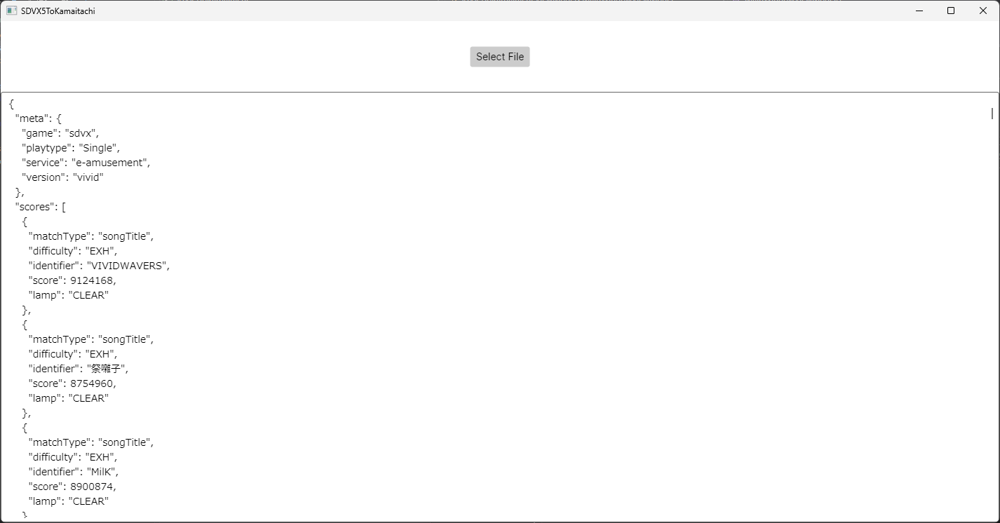

# SDVX5ToKamaitachi
Small software to convert e-amusement CSV from SDVX Vivid Wave to JSON readable by Kamaitachi

## How to use this software?

- Export your CSV from [e-amusement website](https://p.eagate.573.jp/game/sdvx/v/p/playdata/download/index.html) (you might have to enroll to the premium course if you didn't already)
- [Download this software](https://github.com/Xwilarg/SDVX5ToKamaitachi/releases) and start it, select your e-amusement CSV
- The JSON will be outputed on the application, save it in a file with the .json extension
- Go in Kamaitachi website, in the import section select "Batch Manual" and select your file

## Preview

